# TickerIQ System Architecture Overview

## 1. System Overview
TickerIQ is a modular financial analytics platform designed for scalable, multi-agent research and analysis. The system integrates real-time data sources, advanced AI agents, and a modern web interface to deliver actionable insights for financial analysts and investors.

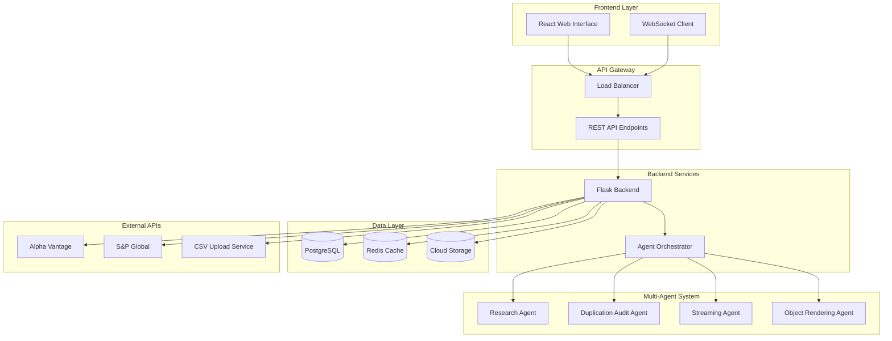

## 2. Core Services Architecture

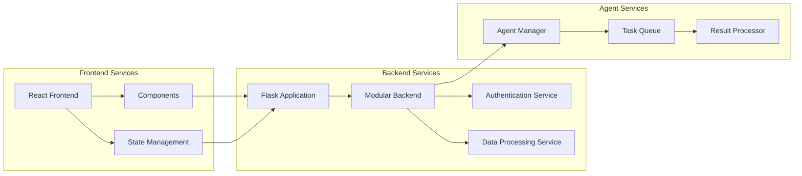

### Service Details:
- **Frontend (React/JS):** User interface for interacting with AI agents, visualizing data, and managing watchlists.
- **Backend (Python/Flask Modular):** Handles API requests, orchestrates multi-agent workflows, manages data pipelines, and serves as the integration point for external services.
- **Data Services:** Ingests and processes financial data from sources like Alpha Vantage, S&P Global, and custom CSV uploads.
- **AI Analysis Agents:** Modular agents for research, duplication audit, streaming analysis, and object rendering. Each agent operates independently and communicates via backend APIs.
- **Database:** Stores user data, watchlists, analysis results, and system logs (PostgreSQL recommended).

## 3. API Architecture

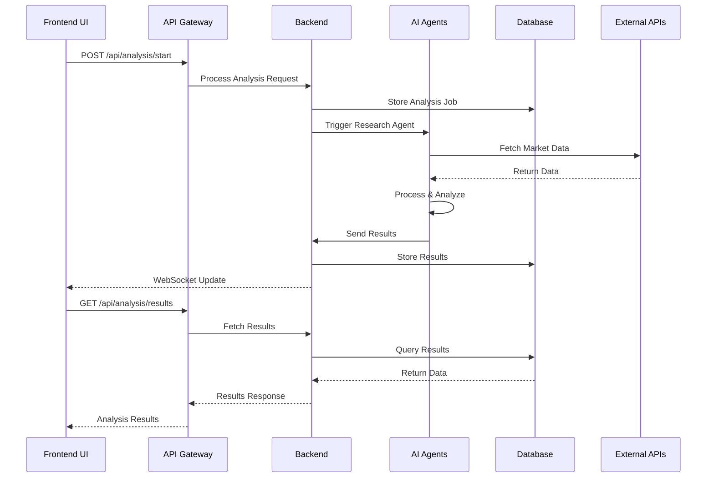

### API Endpoints:
- **RESTful APIs:**
  - `/api/analysis`: Trigger and retrieve AI analysis results.
  - `/api/data`: Manage financial data sources and uploads.
  - `/api/agents`: Orchestrate multi-agent workflows and status.
  - `/api/watchlists`: CRUD operations for user watchlists.
- **Streaming APIs:**
  - WebSocket endpoints for real-time updates and streaming analysis results.

## 4. Multi-Agent Architecture

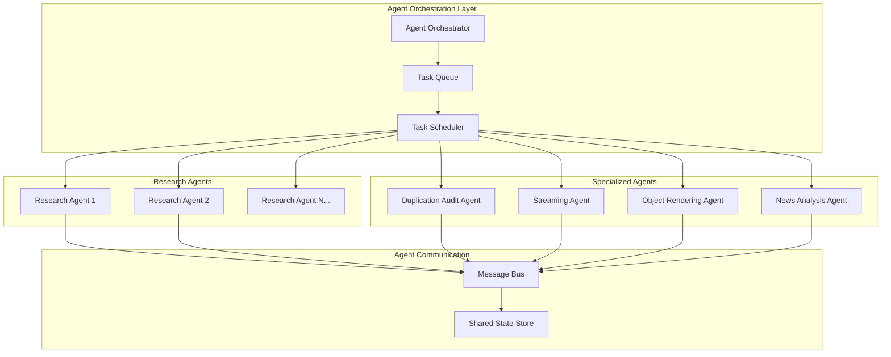

### Agent Communication Flow:
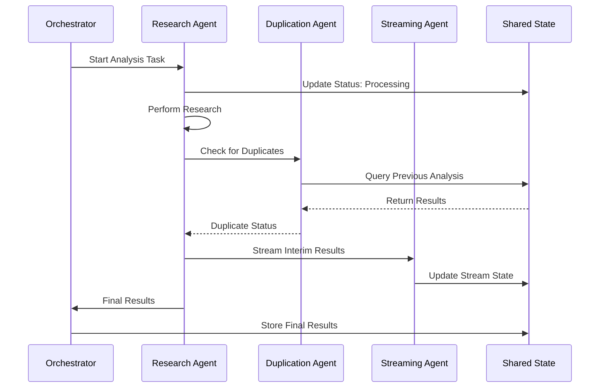

### Agent Details:
- **Agent Types:**
  - Research Agent: Performs deep financial analysis and generates reports.
  - Duplication Audit Agent: Detects and resolves data duplication issues.
  - Streaming Agent: Provides real-time data analysis and UI updates.
  - Object Rendering Agent: Renders complex financial objects and charts.
- **Orchestration:**
  - Agents are orchestrated by the backend, which manages agent lifecycles, task assignment, and inter-agent communication.
  - Agents can be scaled independently for performance and reliability.

## 5. Google Cloud Deployment Architecture

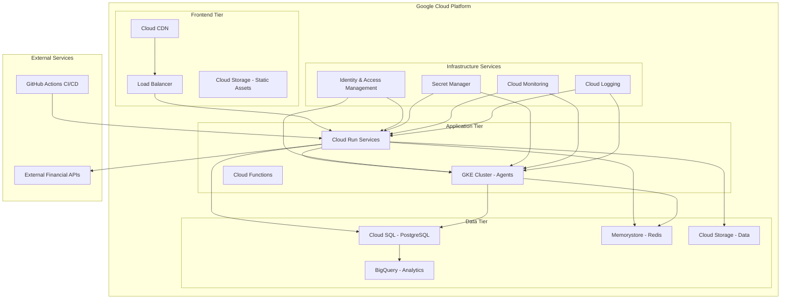

### Deployment Infrastructure:
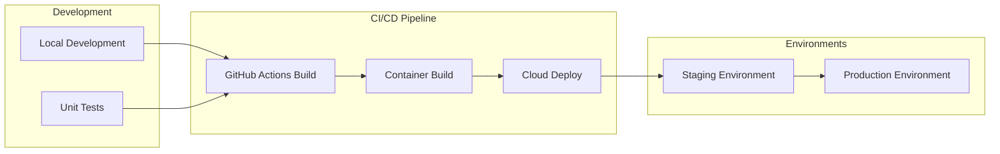

### Cloud Services Details:
- **Compute:**
  - Google Cloud Run for stateless backend services.
  - Google Kubernetes Engine (GKE) for scalable agent orchestration.
- **Storage:**
  - Google Cloud SQL for relational data.
  - Google Cloud Storage for large datasets and CSV uploads.
  - BigQuery for analytics and reporting.
- **Networking:**
  - Google Cloud Load Balancer for traffic management.
  - VPC for secure internal communication between services.
- **CI/CD:**
  - GitHub Actions for automated build, test, and deployment pipelines.
  - Integration with Google Cloud Build for containerization and deployment.

## 6. Security & Monitoring Architecture

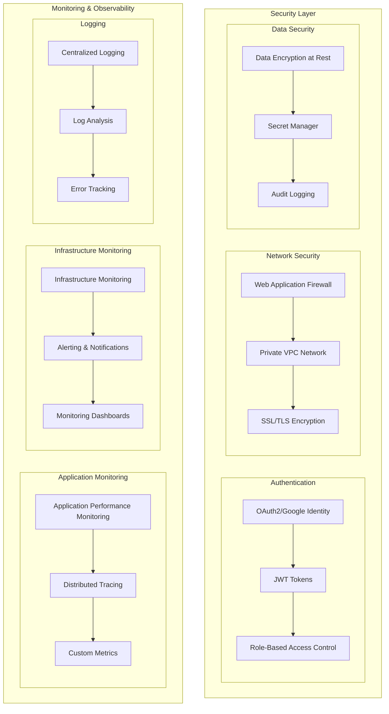

### Data Flow & Security Model:
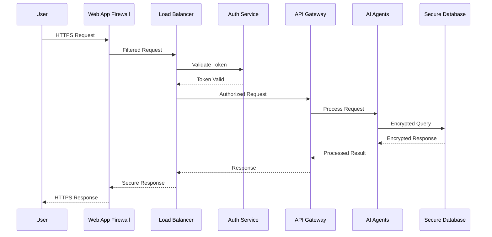

### Security & Monitoring Details:
- **Authentication:** OAuth2/Google Identity for user login with JWT token management.
- **Monitoring:** Google Cloud Monitoring and Logging for system health and audit trails.
- **Secrets Management:** Google Secret Manager for API keys and sensitive credentials.
- **Security Features:**
  - Web Application Firewall (WAF) for request filtering
  - Private VPC networks for service isolation
  - Encryption at rest and in transit
  - Role-based access control (RBAC)
  - Comprehensive audit logging

## 7. Data Architecture & Flow

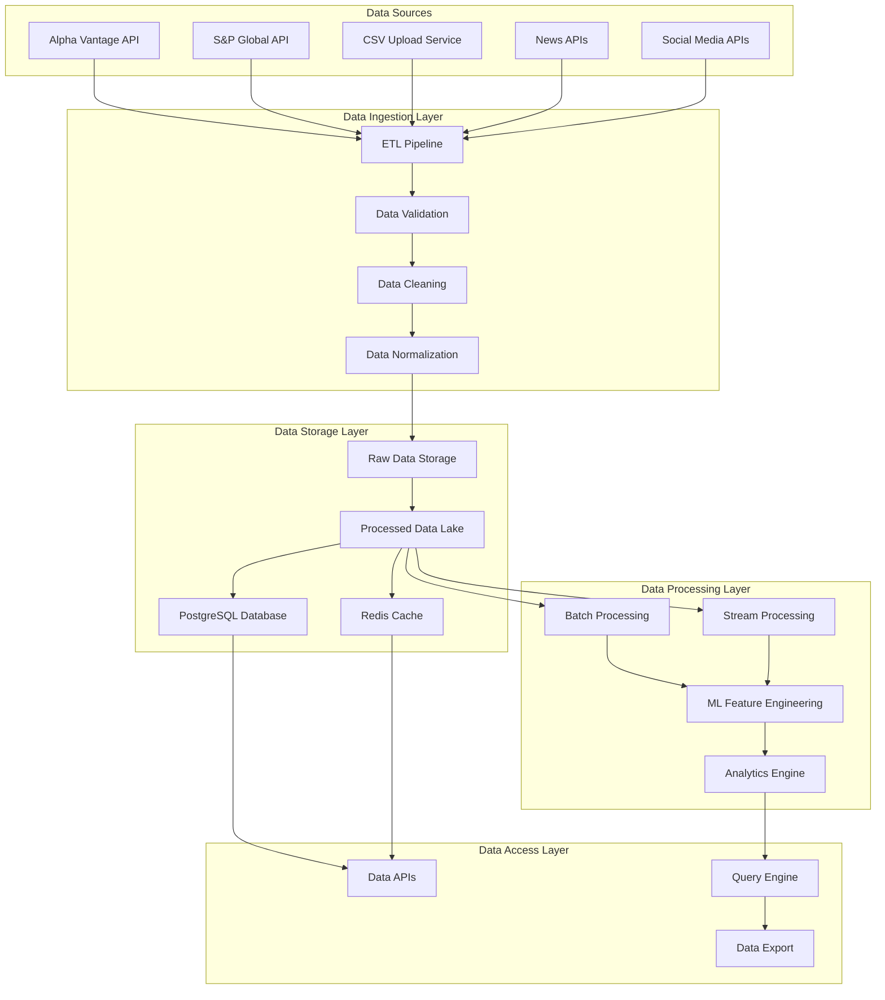

---

## 8. System Performance & Scalability

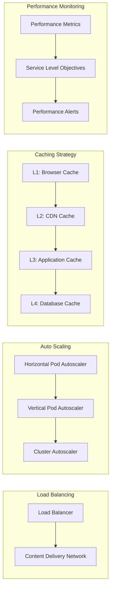

---
For more details, see individual service documentation and deployment guides in the `/docs` and `/cloud-setup.sh` files.