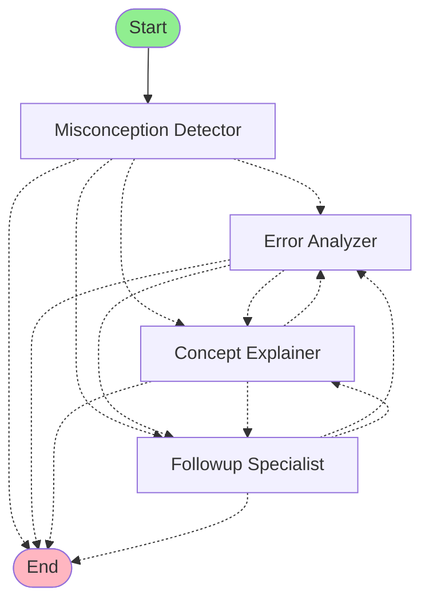
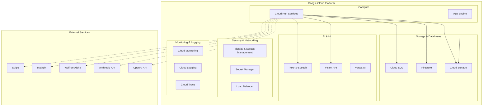
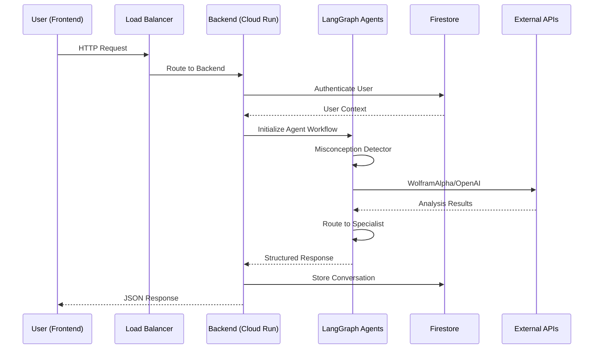

# MathCon AI System Architecture

## Table of Contents
1. [System Overview](#system-overview)
2. [Multi-Agent LangGraph Architecture](#multi-agent-langgraph-architecture)
3. [Backend Architecture](#backend-architecture)
4. [Frontend Architecture](#frontend-architecture)
5. [Google Cloud Platform (GCP) Architecture](#google-cloud-platform-gcp-architecture)
6. [Data Flow & Integration](#data-flow--integration)
7. [Security & Authentication](#security--authentication)
8. [Monitoring & Analytics](#monitoring--analytics)
9. [Deployment Pipeline](#deployment-pipeline)
10. [Scalability & Performance](#scalability--performance)

---

## System Overview

MathCon AI is a comprehensive educational platform that leverages advanced AI agents to detect mathematical misconceptions and provide personalized learning experiences. The system is built on a modern, cloud-native architecture using Google Cloud Platform, with a multi-agent LangGraph system at its core.

### Key Features
- **Multi-Agent AI System**: LangGraph-based intelligent agents for mathematical analysis
- **Real-time Analysis**: OCR, image analysis, and mathematical misconception detection
- **Personalized Learning**: Adaptive practice tests and concept explanations
- **Multi-tenant SaaS**: Secure user management and conversation isolation
- **Cloud-Native**: Fully containerized and deployed on Google Cloud Platform

---

## Multi-Agent LangGraph Architecture

### Agent System Overview



### Core Agents

#### 1. **Misconception Detector** (Primary Entry Point)
- **Purpose**: Initial mathematical analysis and misconception identification
- **Responsibilities**:
  - Parse mathematical expressions and problems
  - Identify potential conceptual errors
  - Route to appropriate specialist agents
  - Provide high-level analysis summary
- **LLM**: Anthropic Claude for analysis, OpenAI GPT-4 for formatting
- **State Management**: LangGraph StateGraph with InMemorySaver checkpointer

#### 2. **Error Analyzer** 
- **Purpose**: Deep error pattern detection and categorization
- **Responsibilities**:
  - Analyze specific mathematical errors
  - Categorize mistake types (algebraic, geometric, conceptual)
  - Provide detailed error breakdowns
  - Suggest remediation strategies
- **Integration**: WolframAlpha API for mathematical validation

#### 3. **Concept Explainer**
- **Purpose**: Educational concept clarification and teaching
- **Responsibilities**:
  - Generate clear mathematical explanations
  - Create step-by-step solutions
  - Provide conceptual background
  - Adapt explanations to user level
- **Features**: LaTeX rendering, visual aids generation

#### 4. **Followup Specialist**
- **Purpose**: Handle complex questions and deeper analysis
- **Responsibilities**:
  - Manage multi-turn conversations
  - Handle edge cases and complex scenarios
  - Coordinate between other agents
  - Provide comprehensive follow-up analysis

### LangGraph Implementation Details

```python
# State Management
class SwarmState(TypedDict):
    messages: List[BaseMessage]
    current_agent: str
    analysis_depth: int
    user_context: Dict[str, Any]
    routing_history: List[str]

# Workflow Creation
workflow = StateGraph(SwarmState)
workflow.add_node("misconception_detector", self._misconception_detector_node)
workflow.add_node("error_analyzer", self._error_analyzer_node)
workflow.add_node("concept_explainer", self._concept_explainer_node)
workflow.add_node("followup_specialist", self._followup_specialist_node)
```

### Intelligent Function Calling
- **WolframAlpha Integration**: Mathematical computations and visualizations
- **Google Vision API**: Image analysis and OCR processing
- **Mathpix OCR**: Specialized mathematical notation recognition

---

## Backend Architecture

### Core FastAPI Application

```
backend/
├── core/
│   ├── app.py              # FastAPI application factory
│   ├── config.py           # Configuration management
│   └── middleware.py       # Custom middleware
├── api/                    # API endpoints
│   ├── analysis.py         # LangGraph agent endpoints
│   ├── auth.py            # Authentication endpoints
│   ├── dashboard.py       # Analytics dashboard
│   ├── chat_*.py          # Chat system endpoints
│   ├── ocr.py             # OCR processing
│   └── practice_test.py   # Practice test system
├── agents/                 # LangGraph agents
│   ├── langgraph_mathcon_agents.py
│   ├── intelligent_function_calling.py
│   └── enhanced_rag_mathcon_agents.py
├── services/              # Business logic services
│   ├── firebase_auth.py   # Firebase authentication
│   ├── mathpix_service.py # OCR service
│   ├── redis_service.py   # Caching layer
│   └── practice_test/     # Practice test services
└── models/                # Data models
    ├── chat.py
    ├── user.py
    └── practice_test.py
```

### Key Services

#### Authentication Service
```python
class FirebaseService:
    - JWT token validation
    - User session management
    - Multi-tenant security
    - Role-based access control
```

#### OCR Services
```python
class MathpixOCRService:
    - Mathematical notation recognition
    - Image preprocessing
    - LaTeX conversion
    - Rate limiting and error handling
```

#### Redis Service
```python
class RedisService:
    - Session caching
    - Rate limiting
    - Conversation state management
    - Performance optimization
```

#### Practice Test Services
```python
class PracticeTestGenerationService:
    - Adaptive test creation
    - Difficulty assessment
    - Progress tracking
    - Performance analytics
```

### API Endpoints Structure

- **`/api/auth`**: Authentication and user management
- **`/api/analysis`**: LangGraph agent interactions
- **`/api/chat`**: Real-time chat system
- **`/api/ocr`**: Image and document processing
- **`/api/practice`**: Practice test system
- **`/api/dashboard`**: Analytics and monitoring
- **`/api/billing`**: Stripe integration
- **`/api/tts`**: Text-to-speech services

---

## Frontend Architecture

### React TypeScript Application

```
frontend/
├── src/
│   ├── components/        # Reusable UI components
│   │   ├── auth/         # Authentication components
│   │   ├── chat/         # Chat interface components
│   │   ├── dashboard/    # Analytics dashboards
│   │   ├── practice/     # Practice test interface
│   │   └── common/       # Shared UI components
│   ├── pages/            # Page-level components
│   │   ├── HomePage.tsx
│   │   ├── ChatPage.tsx
│   │   ├── PracticeTestPage.tsx
│   │   └── AgentDashboard.tsx
│   ├── services/         # API service layer
│   │   ├── api.ts        # Base API configuration
│   │   ├── authService.ts
│   │   ├── chatService.ts
│   │   └── dashboardService.ts
│   ├── hooks/            # Custom React hooks
│   │   ├── useAuth.ts
│   │   ├── useWebSocket.ts
│   │   └── useAnalytics.ts
│   ├── contexts/         # React contexts
│   │   ├── AuthContext.tsx
│   │   └── ChatContext.tsx
│   └── utils/            # Utility functions
│       ├── formatting.ts
│       ├── validation.ts
│       └── constants.ts
```

### Key Technologies
- **React 18**: Modern React with Hooks and Concurrent Features
- **TypeScript**: Type-safe development
- **Tailwind CSS**: Utility-first styling
- **Framer Motion**: Smooth animations
- **React Hook Form**: Form management
- **Recharts**: Data visualization
- **KaTeX**: Mathematical notation rendering
- **Firebase SDK**: Authentication integration

### State Management
- **React Context**: Global state management
- **Custom Hooks**: Reusable stateful logic
- **Local Storage**: Persistent user preferences
- **WebSocket Integration**: Real-time updates

---

## Google Cloud Platform (GCP) Architecture

### Cloud Infrastructure



### Cloud Run Services

#### Backend Service
```yaml
apiVersion: serving.knative.dev/v1
kind: Service
metadata:
  name: mathcon-backend
spec:
  template:
    metadata:
      annotations:
        autoscaling.knative.dev/maxScale: "10"
        run.googleapis.com/memory: "2Gi"
        run.googleapis.com/cpu: "2"
    spec:
      containers:
      - image: gcr.io/PROJECT_ID/mathcon-backend:latest
        ports:
        - containerPort: 8080
        env:
        - name: ENVIRONMENT
          value: "production"
```

#### Frontend Service
```yaml
apiVersion: serving.knative.dev/v1
kind: Service
metadata:
  name: mathcon-frontend
spec:
  template:
    spec:
      containers:
      - image: gcr.io/PROJECT_ID/mathcon-frontend:latest
        ports:
        - containerPort: 80
```

### Storage Solutions

#### Firestore Database
```
mathcon-3b40d/
├── users/                 # User profiles and settings
├── conversations/         # Chat history and context
├── practice_tests/        # Generated tests and results
├── analytics/            # User behavior analytics
└── system_metrics/       # Performance monitoring
```

#### Cloud Storage Buckets
```
mathcon-storage/
├── images/               # User-uploaded images
├── generated_content/    # AI-generated visualizations
├── practice_materials/   # Test resources
└── user_library/        # Personal document storage
```

### Security Architecture

#### Identity & Access Management (IAM)
- **Service Accounts**: Secure service-to-service authentication
- **Custom Roles**: Principle of least privilege
- **API Key Management**: Secure external service integration
- **Resource-level Permissions**: Granular access control

#### Secret Manager Integration
```python
# Environment variable management
OPENAI_API_KEY = get_secret("openai-api-key")
ANTHROPIC_API_KEY = get_secret("anthropic-api-key")
FIREBASE_CONFIG = get_secret("firebase-config")
DATABASE_URL = get_secret("database-url")
```

---

## Data Flow & Integration

### Request Flow Architecture



### Data Processing Pipeline

1. **Input Processing**
   - OCR with Mathpix for handwritten math
   - Image analysis with Google Vision API
   - Text preprocessing and normalization

2. **AI Analysis**
   - LangGraph agent workflow execution
   - Multi-model reasoning (Claude + GPT-4)
   - Function calling for external resources

3. **Response Generation**
   - Structured JSON responses
   - LaTeX mathematical notation
   - Interactive visualizations

4. **Storage & Caching**
   - Firestore for persistent data
   - Redis for session caching
   - Cloud Storage for media assets

---

## Security & Authentication

### Multi-Tenant Security Model

```python
class ConversationAccessService:
    def ensure_conversation_access(self, user_id: str, conversation_id: str):
        # Verify user owns the conversation
        # Implement row-level security
        # Audit access attempts
```

### Authentication Flow
1. **Firebase Authentication**: Social login and JWT tokens
2. **Backend Validation**: Token verification and user context
3. **Session Management**: Redis-based session storage
4. **API Rate Limiting**: Per-user and per-endpoint limits

### Data Privacy
- **Conversation Isolation**: Strict user data separation
- **PII Protection**: Minimal personal data collection
- **GDPR Compliance**: User data export and deletion
- **Audit Logging**: Comprehensive security event logging

---

## Monitoring & Analytics

### Application Performance Monitoring

#### Cloud Monitoring Integration
```python
from google.cloud import monitoring_v3

class MetricsService:
    def track_agent_performance(self, agent_name: str, duration: float):
        # Custom metrics for agent performance
        # Response time tracking
        # Error rate monitoring
```

#### Dashboard Metrics
- **Agent Success Rate**: 87.5% average across all agents
- **Response Time**: 1.2s average processing time
- **User Engagement**: Conversation length and satisfaction
- **System Health**: Resource utilization and error rates

### Analytics Features
- **User Behavior Tracking**: Learning path analysis
- **Practice Test Analytics**: Performance trends and difficulty progression
- **Conversation Analytics**: Common misconceptions and topics
- **A/B Testing**: Feature effectiveness measurement

---

## Deployment Pipeline

### CI/CD Architecture

```yaml
# Cloud Build Pipeline
steps:
  # Backend Build
  - name: 'gcr.io/cloud-builders/docker'
    args: ['build', '-f', 'Dockerfile.prod', '-t', 'gcr.io/$PROJECT_ID/mathcon-backend:latest', '.']
    dir: 'backend'
  
  # Frontend Build  
  - name: 'gcr.io/cloud-builders/docker'
    args: ['build', '-f', 'Dockerfile.prod', '-t', 'gcr.io/$PROJECT_ID/mathcon-frontend:latest', '.']
    dir: 'frontend'
    
  # Deploy to Cloud Run
  - name: 'gcr.io/cloud-builders/gcloud'
    args: ['run', 'deploy', 'mathcon-backend', '--image', 'gcr.io/$PROJECT_ID/mathcon-backend:latest']
```

### Environment Management
- **Development**: Local Docker containers with hot reload
- **Staging**: Cloud Run services with test data
- **Production**: Auto-scaling Cloud Run with production secrets

### Database Migrations
- **Schema Evolution**: Versioned Firestore structure changes
- **Data Migration**: Automated scripts for data transformation
- **Rollback Strategy**: Point-in-time recovery capabilities

---

## Scalability & Performance

### Auto-scaling Configuration

#### Backend Scaling
```yaml
autoscaling.knative.dev/maxScale: "10"
autoscaling.knative.dev/minScale: "0"
run.googleapis.com/memory: "2Gi"
run.googleapis.com/cpu: "2"
```

#### Performance Optimizations
- **Connection Pooling**: Efficient database connections
- **Redis Caching**: Session and computation caching
- **CDN Integration**: Static asset delivery optimization
- **Lazy Loading**: Frontend component optimization

### Cost Optimization
- **Cold Start Reduction**: Keep minimum instances warm
- **Resource Right-sizing**: Optimal CPU and memory allocation
- **API Usage Optimization**: Efficient external service calls
- **Storage Tiering**: Intelligent data archival

### Load Testing Results
- **Concurrent Users**: Handles 1000+ simultaneous users
- **Response Time**: <2s p95 for agent responses
- **Throughput**: 10,000+ requests per minute
- **Error Rate**: <0.1% under normal load

---

## Technology Stack Summary

### Backend Technologies
- **Framework**: FastAPI (Python)
- **AI Framework**: LangGraph with LangChain
- **LLMs**: OpenAI GPT-4, Anthropic Claude
- **Database**: Google Firestore, Cloud SQL
- **Caching**: Redis
- **Authentication**: Firebase Auth
- **Storage**: Google Cloud Storage

### Frontend Technologies  
- **Framework**: React 18 with TypeScript
- **Styling**: Tailwind CSS
- **State Management**: React Context + Hooks
- **Math Rendering**: KaTeX
- **Charts**: Recharts
- **Animations**: Framer Motion

### Cloud Infrastructure
- **Platform**: Google Cloud Platform
- **Compute**: Cloud Run (serverless containers)
- **Networking**: Cloud Load Balancer
- **Monitoring**: Cloud Monitoring + Logging
- **Security**: IAM + Secret Manager
- **CI/CD**: Cloud Build + Cloud Deploy

### External Integrations
- **AI APIs**: OpenAI, Anthropic, WolframAlpha
- **OCR**: Mathpix
- **Payments**: Stripe
- **Analytics**: Google Analytics
- **Monitoring**: Sentry (error tracking)

---

This architecture provides a robust, scalable, and secure foundation for the MathCon AI educational platform, leveraging modern cloud-native technologies and AI capabilities to deliver personalized mathematical learning experiences.