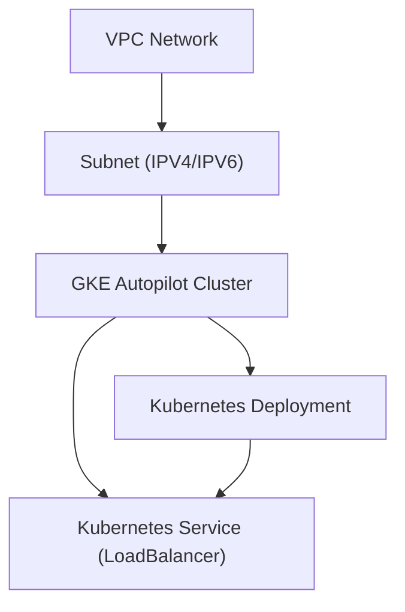

# GKE Architecture Overview

This document provides a high-level architecture graph and folder scan for the GKE samples in this repository.

## Directory Structure

```
gke/
├── quickstart/
│   ├── autopilot/
│   │   ├── cluster.tf        # VPC, subnet, GKE Autopilot cluster
│   │   └── app.tf            # Kubernetes deployment & service
│   └── multitenant/
│       ├── backend.yaml      # Backend service manifest
│       ├── frontend.yaml     # Frontend service manifest
│       └── main.tf           # Cluster and resource definitions
├── enterprise/
│   ├── config_sync/
│   │   ├── git/
│   │   │   ├── main.tf
│   │   │   └── test.yaml
│   │   └── oci/
│   │       ├── main.tf
│   │       └── test.yaml
│   ├── enable/
│   │   └── main.tf
│   ├── mesh/
│   │   └── main.tf
│   └── policycontroller/
│       └── main.tf
├── standard/
│   ├── regional/
│   │   ├── binary-authorization/
│   │   ├── gemma-tgi/
│   │   ├── hpa-logs/
│   │   ├── labels/
│   │   ├── loadbalancer/
│   │   ├── multi-zone/
│   │   ├── node_pool/
│   │   ├── node_system_config/
│   │   ├── ray/
│   │   ├── single-zone/
│   │   └── windows/
│   └── zonal/
│       ├── arm/
│       ├── dws/
│       ├── gpu/
│       ├── multi-zone/
│       ├── no-channel-to-release-channel/
│       ├── node_image/
│       ├── reservation/
│       ├── secondary-boot-disk/
│       └── single-zone/
```

## Architecture Graph (Quickstart Autopilot)



- **VPC Network**: Defined in `cluster.tf`.
- **Subnet**: Custom subnet with secondary IP ranges for services and pods.
- **GKE Autopilot Cluster**: Managed Kubernetes cluster.
- **Kubernetes Deployment**: Example app deployed to the cluster.
- **Kubernetes Service**: LoadBalancer service exposing the app.

---

For other folders, similar patterns apply with variations for enterprise, standard, and multitenant setups.
